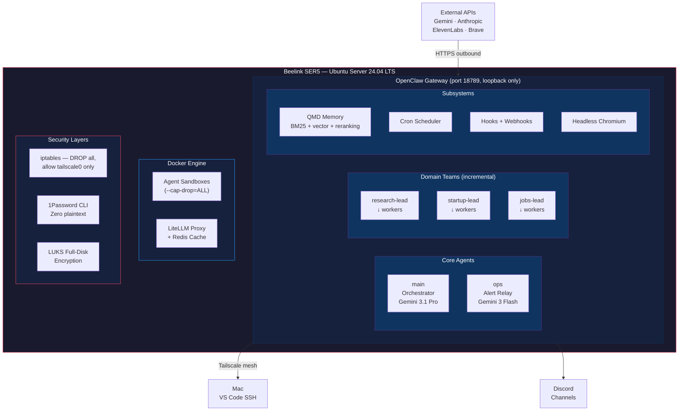

# Hive — Self-Hosted Multi-Agent AI Infrastructure

> Production multi-agent AI system running on commodity hardware with defense-in-depth security, automated workflows, and self-improving agents.

---

**This repository documents the architecture and design decisions for Hive. Source code is available upon request for interview processes.**

📄 [Portfolio Case Study](https://jamesshehan.dev/projects/hive) · 📝 [Blog Deep Dive](https://jamesshehan.dev/blog/architecture-decisions-self-hosting-multi-agent-ai) · 📬 [Request Source Access](mailto:james@jamesshehan.dev?subject=Source%20Access%20Request%20—%20Hive)

---

## Problem

Cloud AI agent services (Azure AI Agent Service, AWS Bedrock Agents) charge per-interaction, offer limited customization, and create vendor lock-in. For a TPM/SA building personal AI infrastructure — automated research, email triage, cron-driven workflows, cross-agent knowledge sharing — cloud costs compound quickly, observability is opaque, and multi-agent orchestration is constrained by provider abstractions.

The challenge: build a production multi-agent system on a $350 mini PC that matches the reliability, security, and capability of cloud-hosted alternatives — from network security through agent sandboxing to self-improving behavior.

## Architecture

Hive runs on a single Beelink SER5 mini PC with a **6-layer security model**, modular agent teams, and zero public-facing ports.

| Component | Function |
|-----------|----------|
| **OpenClaw Gateway** | Agent lifecycle, session management, tool routing, bindings to Discord/CLI/webhooks |
| **Orchestrator (main)** | Depth-1 agent: delegates to domain team leads, manages config, broad tool access |
| **Domain Team Leads** | Depth-1 specialists: research, startup analysis, job search — each spawns depth-2 workers |
| **QMD Memory** | Hybrid search (BM25 + vector embeddings + MMR reranking) with temporal decay — zero API cost |
| **LiteLLM Proxy** | Model routing with hard monthly budget caps, per-model spend tracking, semantic caching, cross-group fallback |
| **Docker Sandboxes** | Per-agent isolation with `--cap-drop=ALL`, `--security-opt=no-new-privileges`, no network access |

## Tech Stack

| Technology | Role | Why This Choice |
|-----------|------|-----------------|
| Ubuntu Server 24.04 LTS | Host OS | Headless, LTS support, unattended security upgrades |
| Beelink SER5 | Hardware | AMD Ryzen 5 5500U (6C/12T), 28GB RAM, 500GB NVMe — $350, silent, low power |
| OpenClaw | Agent framework | Multi-agent orchestration, depth-2 nesting, Docker sandboxing, session management |
| Google Gemini API | Primary LLM | Cost-effective (free tier for development), high quality, tool-use capable |
| LiteLLM + Redis | Model proxy + cache | Multi-provider routing, budget caps, semantic caching, fallback chains |
| Docker | Agent sandboxing | Per-agent containers with dropped capabilities and no network |
| QMD + Bun | Semantic memory | BM25 + vector + MMR re-ranking, temporal decay, zero API cost for retrieval |
| Tailscale | Network mesh | WireGuard-based, zero-config VPN, enables zero public ports |
| iptables | Firewall | INPUT DROP policy, only loopback + tailscale0 accepted |
| 1Password CLI | Secrets management | `op run` injects credentials at runtime, zero plaintext on disk |
| LUKS + TPM2 | Disk encryption | Full-disk encryption with auto-unseal via TPM2 |
| systemd (user units) | Service management | `loginctl enable-linger` for persistent agent processes |

## 6-Layer Security Model

| Layer | Control | Implementation |
|-------|---------|----------------|
| **1. Network Invisibility** | Zero public ports | iptables INPUT DROP + Tailscale-only access |
| **2. Secrets Management** | No plaintext credentials | 1Password CLI + tmpfs env file via systemd EnvironmentFile |
| **3. Access Control** | Per-user, per-agent isolation | DM pairing, session scoping, mention-gating, layered tool policies |
| **3.5. Prompt Injection** | Untrusted content isolation | Sandboxed agents process external content; denied `sessions_send`/`sessions_spawn` |
| **4. Execution Isolation** | Per-agent Docker sandboxing | `--cap-drop=ALL`, `--security-opt=no-new-privileges`, no network, `scope: "agent"` |
| **5. Infrastructure** | Host hardening | LUKS encryption, dedicated service user, 700/600 file permissions, security-only auto-updates |
| **6. Supply Chain** | Dependency vetting | Plugin allowlist, version pinning, `openclaw security audit --deep`, ClawHub skills vetting (ADR-017) |

## Technical Challenges & Solutions

### 1. Docker Sandbox Permission Model

**Challenge**: `--cap-drop=ALL` removes `DAC_OVERRIDE` (the capability that lets root bypass file permissions). Agent processes running as non-root inside containers can't write to workspace directories mounted from the host, even with bind mounts.

**Solution**: `chmod 777` on workspace directories before container launch (ADR-012). This is acceptable because the sandbox's security boundary is the container itself (no network, dropped capabilities, no-new-privileges), not filesystem permissions within the container. The workspace is agent-scoped — cross-agent data isolation is enforced by separate bind mounts, not POSIX permissions.

### 2. Elevated Exec Deadlock

**Challenge**: Setting `elevatedDefault: "on"` routes ALL exec calls for ALL agents to the host (requiring manual approval via Discord). With 5+ agents running, the approval queue becomes a bottleneck, and if Discord is unreachable, all agents deadlock — no exec at all.

**Solution**: Keep `elevatedDefault` off (omitted from config). Agents exec inside their Docker sandbox by default (no approval needed). Only the orchestrator (`main`) can request elevated (host-level) exec, gated by per-command approval via Discord. Anti-pattern documented: never set per-agent `elevated.enabled: true` on sandboxed agents — it has the same deadlocking effect.

### 3. Secrets on a Budget

**Challenge**: 1Password Individual plan doesn't support service accounts or Connect Server. Production agent frameworks need credentials injected at runtime without human interaction — but `op` CLI requires either an interactive session or specific auth mechanisms.

**Solution**: Hybrid secrets model (ADR-003). systemd `EnvironmentFile` loads credentials from a tmpfs-backed file (`/run/openclaw-credentials/.env`) populated at boot via `op run`. Config uses `${ENV_VAR}` substitution for fields that don't support OpenClaw's native SecretRef. Net result: zero plaintext secrets on persistent disk, runtime injection without service accounts.

## Key Decisions

| ADR | Decision | Rationale |
|-----|----------|-----------|
| ADR-001 | OpenClaw-Native Architecture | Custom agent framework provides depth-2 nesting, Discord integration, and Docker sandboxing that cloud alternatives lack |
| ADR-003 | 1Password Hybrid Secrets | Budget-friendly secrets management: `op run` + tmpfs + env substitution, zero plaintext on disk |
| ADR-012 | Docker Privilege Model | `--cap-drop=ALL` + `chmod 777` workspace: sandbox boundary is the container, not POSIX permissions |
| ADR-014 | Modular Domain Team Architecture | Teams added incrementally without architectural changes; depth-2 nesting (lead → workers) |
| ADR-016 | Adaptive Self-Improvement | Weekly self-assessment cron, tiered config change autonomy, cross-agent knowledge sharing |
| ADR-020 | Runtime Change Protocol | Structured workflow for config changes: propose → verify → apply → test → commit |

See [docs/tech-decisions.md](docs/tech-decisions.md) for detailed ADR excerpts.

## Results

- **22 Architectural Decision Records** documenting every significant technical choice
- **130+ development tasks** across 8 completed phases with verification gates
- **6-layer security model** from network to supply chain
- **5+ agents running** with modular domain team architecture
- **Zero public ports** — true network invisibility via Tailscale mesh
- **Weekly self-assessment cron** with cross-agent knowledge sharing
- **Encrypted backups** automated via LUKS + systemd timers
- **$10–29/month operating cost** on commodity hardware

## Project Status

| Phase | Status | Description |
|-------|--------|-------------|
| Phase 0: Foundation | ✅ | Hardware, OS, network, Tailscale mesh |
| Phase 1: Core OpenClaw | ✅ | Gateway install, config, agent setup |
| Phase 2: Security Hardening | ✅ | 6-layer security, 1Password, LUKS |
| Phase 3A: Multi-Agent | ✅ | Domain teams, depth-2 nesting, tool policies |
| Phase 3B: Memory & Automation | ✅ | QMD, cron scheduler, webhooks |
| Phase 3C: Extensions | ✅ | LiteLLM, voice pipeline, browser automation |
| Phase 4: Expansion | ✅ | Firewall hardening, skill deployment |
| Phase 5: Polish & Observability | ✅ | Mermaid diagrams, CI, Langfuse |
| Phase 6: Production Hardening | ✅ | Auto-updates, backup automation |
| Phase 7: CC Runtime Engine | ✅ | Claude Code CLI integration, piped automation, build hooks |

---

**Built by [James Shehan](https://jamesshehan.dev)** · TPM / Solutions Architect

📬 [Request source code access](mailto:james@jamesshehan.dev?subject=Source%20Access%20Request%20—%20Hive) for interview review
