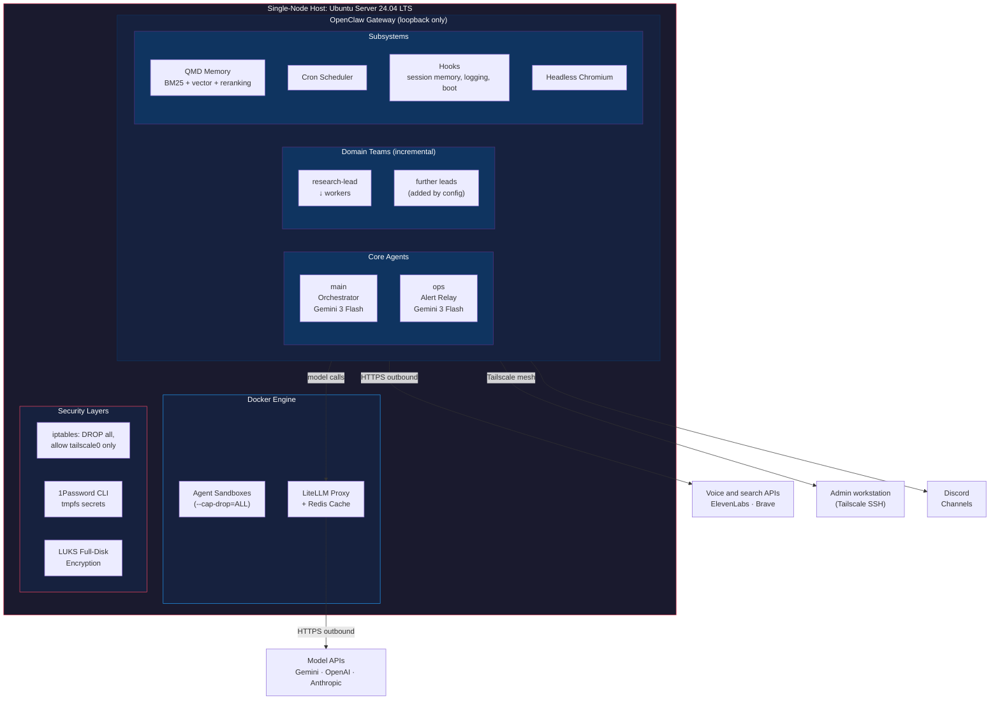

# Hive: Self-Hosted AI Agent Platform

> A self-hosted multi-agent platform I built for my own research, email triage and scheduled workflows, with per-agent Docker sandboxing, zero public ports and a hard monthly spending ceiling. Development is paused.

---

**This repository documents the architecture and design decisions for Hive. The implementation is private.**

[Portfolio case study](https://jamesshehan.dev/projects/hive) · [Blog post](https://jamesshehan.dev/blog/architecture-decisions-self-hosting-multi-agent-ai)

---

## Problem

I built Hive to run my own research, email triage and scheduled workflows on one self-hosted server. Hosted agent services (such as Azure AI Agent Service and AWS Bedrock Agents) meter usage, limit customization and tie the work to one vendor, so costs add up, it is hard to see what the agents are doing, and orchestration is limited to what the provider offers.

The work was to run a multi-agent system on one self-hosted server and own its security, cost governance, memory recall and uptime myself.

## Architecture

Hive runs on a single machine with **security in layers**, modular agent teams and zero public-facing ports.

```mermaid
graph TB
    subgraph Host["Single-Node Host: Ubuntu Server 24.04 LTS"]
        subgraph Gateway["OpenClaw Gateway (loopback only)"]
            subgraph Core["Core Agents"]
                main["main<br/>Orchestrator<br/>Gemini 3 Flash"]
                ops["ops<br/>Alert Relay<br/>Gemini 3 Flash"]
            end
            subgraph Teams["Domain Teams (incremental)"]
                research["research-lead<br/>↓ workers"]
                more["further leads<br/>(added by config)"]
            end
            subgraph Subs["Subsystems"]
                qmd["QMD Memory<br/>BM25 + vector + reranking"]
                cron["Cron Scheduler"]
                hooks["Hooks<br/>session memory, logging, boot"]
                chromium["Headless Chromium"]
            end
        end
        subgraph Docker["Docker Engine"]
            sandbox["Agent Sandboxes<br/>(--cap-drop=ALL)"]
            litellm["LiteLLM Proxy<br/>+ Redis Cache"]
        end
        subgraph Security["Security Layers"]
            ipt["iptables: DROP all,<br/>allow tailscale0 only"]
            op["1Password CLI<br/>tmpfs secrets"]
            luks["LUKS Full-Disk<br/>Encryption"]
        end
    end

    Gateway -->|model calls| litellm
    litellm -->|HTTPS outbound| APIs["Model APIs<br/>Gemini · OpenAI · Anthropic"]
    Gateway -->|HTTPS outbound| Tools["Voice and search APIs<br/>ElevenLabs · Brave"]
    Gateway -->|Tailscale mesh| Mac["Admin workstation<br/>(Tailscale SSH)"]
    Gateway --> Discord["Discord<br/>Channels"]

    style Host fill:#1a1a2e,stroke:#e94560,color:#fff
    style Gateway fill:#16213e,stroke:#0f3460,color:#fff
    style Core fill:#0f3460,stroke:#533483,color:#fff
    style Teams fill:#0f3460,stroke:#533483,color:#fff
    style Subs fill:#0f3460,stroke:#533483,color:#fff
    style Docker fill:#16213e,stroke:#2496ED,color:#fff
    style Security fill:#16213e,stroke:#e94560,color:#fff
```

| Component | Function |
|-----------|----------|
| **OpenClaw Gateway** | Agent lifecycle, session management, tool routing, bindings to Discord and the CLI |
| **Orchestrator (main)** | Top-level agent (depth 0): delegates to domain team leads, manages config, broad tool access |
| **Domain Team Leads** | Depth-1 specialists, starting with the research lead, each spawning depth-2 workers |
| **QMD Memory** | Hybrid search (BM25 + vector embeddings + MMR reranking) with temporal decay; zero API cost |
| **LiteLLM Proxy** | Model routing with hard monthly budget caps, per-model spend tracking, semantic caching, cross-group fallback |
| **Docker Sandboxes** | Per-agent isolation with `--cap-drop=ALL`, `--security-opt=no-new-privileges`, no network access |

## Tech Stack

| Technology | Role | Why This Choice |
|-----------|------|-----------------|
| Ubuntu Server 24.04 LTS | Host OS | Headless, LTS support, unattended security upgrades |
| OpenClaw | Agent framework | Multi-agent orchestration, depth-2 nesting, Docker sandboxing, session management |
| Google Gemini API | Primary LLM | Flash for routing and triage, Pro where output quality depends on the model, tool-use capable |
| LiteLLM + Redis | Model proxy + cache | Multi-provider routing, budget caps, semantic caching, fallback chains |
| Docker | Agent sandboxing | Per-agent containers with dropped capabilities and no network |
| QMD + Bun | Semantic memory | BM25 + vector + MMR re-ranking, temporal decay, zero API cost for retrieval |
| Tailscale | Network mesh | WireGuard-based mesh VPN, enables zero public ports |
| iptables | Firewall | INPUT DROP policy, only loopback + tailscale0 accepted |
| 1Password CLI | Secrets management | `op run` injects credentials at runtime, zero plaintext on persistent disk |
| LUKS + TPM2 | Disk encryption | Full-disk encryption with auto-unseal via TPM2 |
| systemd (user units) | Service management | `loginctl enable-linger` for persistent agent processes |

## Security Model: Defense in Depth

| Layer | Control | Implementation |
|-------|---------|----------------|
| **Network Isolation** | Zero public ports | iptables INPUT DROP + Tailscale-only access |
| **Secrets Management** | No plaintext credentials | 1Password CLI + tmpfs env file via systemd EnvironmentFile |
| **Access Control** | Per-user, per-agent isolation | DM pairing, session scoping, mention-gating, layered tool policies |
| **Prompt Injection** | Untrusted content isolation | Sandboxed agents process external content; denied `sessions_send`/`sessions_spawn` |
| **Execution Isolation** | Per-agent Docker sandboxing | `--cap-drop=ALL`, `--security-opt=no-new-privileges`, no network, `scope: "agent"` |
| **Infrastructure** | Host hardening | LUKS encryption, dedicated service user, 700/600 file permissions, security-only auto-updates |
| **Supply Chain** | Dependency vetting | Plugin allowlist, version pinning, `openclaw security audit --deep`, ClawHub skills vetting (ADR-017) |

## Technical Challenges & Solutions

### 1. Docker Sandbox Permission Model

**Challenge**: `--cap-drop=ALL` removes `DAC_OVERRIDE` (the capability that lets root bypass file permissions). Agent processes running as root inside the containers therefore can't write to workspace directories mounted from the host, because the host enforces POSIX permissions.

**Solution**: Accepted standard Docker over rootless for a single-user machine and made the container the boundary: no network, dropped capabilities and no-new-privileges, with each agent's workspace on its own bind mount (ADR-012).

### 2. Host Exec Deadlock

**Challenge**: Setting `elevatedDefault: "on"` routes ALL exec calls for ALL agents to the host (requiring manual approval via Discord). With 5+ agents running, the approval queue becomes a bottleneck, and if Discord is unreachable, all agents deadlock with no exec at all.

**Solution**: Keep `elevatedDefault` off (omitted from config). Agents exec inside their Docker sandbox by default (no approval needed). Only the orchestrator (`main`) can request host-level exec, gated by per-command approval via Discord. Anti-pattern documented: never set per-agent `elevated.enabled: true` on sandboxed agents, since it has the same deadlocking effect.

### 3. Secrets Without Service Accounts

**Challenge**: 1Password Individual plan doesn't support service accounts or Connect Server, the usual way to inject credentials at runtime with no human in the loop, and the `op` CLI otherwise needs an interactive session.

**Solution**: Hybrid secrets model (ADR-003). systemd `EnvironmentFile` loads credentials from a tmpfs-backed file that `op run` populates after a manual 1Password sign-in on each reboot. Config uses `${ENV_VAR}` substitution for fields that don't support OpenClaw's native SecretRef. The one manual sign-in after a reboot is an accepted trade-off. Net result: zero plaintext secrets on persistent disk, runtime injection without service accounts.

## Key Decisions

| ADR | Decision | Rationale |
|-----|----------|-----------|
| ADR-001 | OpenClaw-Native Architecture | OpenClaw already provides multi-agent routing, memory, cron, channels and sandboxing, so the work became configuration instead of a custom orchestration build |
| ADR-003 | 1Password Hybrid Secrets | Secrets management without service accounts: `op run` + tmpfs + env substitution, zero plaintext on persistent disk |
| ADR-012 | Docker Privilege Model | Standard Docker with --cap-drop=ALL: the sandbox boundary is the container |
| ADR-014 | Modular Domain Team Architecture | Teams added incrementally without architectural changes; depth-2 nesting (lead → workers) |
| ADR-016 | Adaptive Self-Improvement | Weekly self-assessment cron, tiered config change autonomy, cross-agent knowledge sharing |
| ADR-020 | Runtime Change Protocol | Every change to the live system goes through plan → apply → verify, with a config snapshot taken first for instant rollback |
| ADR-024 | Cost Optimization After Google Cloud Credits | Per-agent model tiering holds spend under a hard monthly ceiling after free credits were exhausted: the orchestrator drops to Flash alongside ops, leads whose output quality depends on the model stay on Pro, and the Anthropic fallback shifts Sonnet to Haiku for every agent except the research lead |
| ADR-025 | Active Memory Plugin Adoption | Retrieval over the existing QMD memory before each reply, enabled for main and the domain leads (not ops) |

See [docs/tech-decisions.md](docs/tech-decisions.md) for detailed ADR excerpts.

## Results

- **25 Architecture Decision Records** covering the main technical choices
- **130+ development tasks** across the completed phases; development is paused
- **Security layered from network to supply chain**
- **Modular domain teams**: an orchestrator and an ops agent, with domain leads starting from research-lead and workers spawned on demand
- **Retrieval over QMD memory before each reply** for the orchestrator and domain leads, via the OpenClaw Active Memory plugin
- **Zero public ports**: reachable only over the Tailscale mesh; no inbound exposure on any public interface
- **Weekly self-assessment cron** with cross-agent knowledge sharing
- **Encrypted disks (LUKS with TPM2 auto-unlock) and daily encrypted backups on a cron job**
- **Cost-governed model tiering after the Google Cloud credits ran out**: per-agent Pro/Flash/Haiku assignments hold spend under a hard monthly ceiling

## Project Status

| Phase | Status | Description |
|-------|--------|-------------|
| Phase 0: Foundation | Done | Hardware, OS, network, Tailscale mesh |
| Phase 1: Core OpenClaw | Done | Gateway install, config, agent setup |
| Phase 2: Security Hardening | Done | Layered security, 1Password, LUKS |
| Phase 3A: Multi-Agent | Done | Domain teams, depth-2 nesting, tool policies |
| Phase 3B: Memory & Automation | Done | QMD, cron scheduler, webhooks |
| Phase 3C: Extensions | Done | LiteLLM, voice pipeline, browser automation |
| Phase 4: Expansion | Done | Firewall hardening, skill deployment |
| Phase 5: Polish & Observability | Done | Mermaid diagrams, CI, Langfuse |
| Phase 6: Proactive Intelligence | Done | Morning briefing upgrades, research-lead activation, research tooling |
| Phase 7: Claude Code Runtime | Done | Claude Code CLI integration, piped automation, build hooks |
| Phase 7E: Research-Lead Reasoning | Paused | Reasoning expansion, citation discipline, anti-fabrication hardening; integration testing |
| Phase 8: Research Pipeline Expansion | Paused | Extended document extraction, structured output generation, Google Docs integration; validation was pending when development paused |

---

**Built by [James Shehan](https://jamesshehan.dev)**

